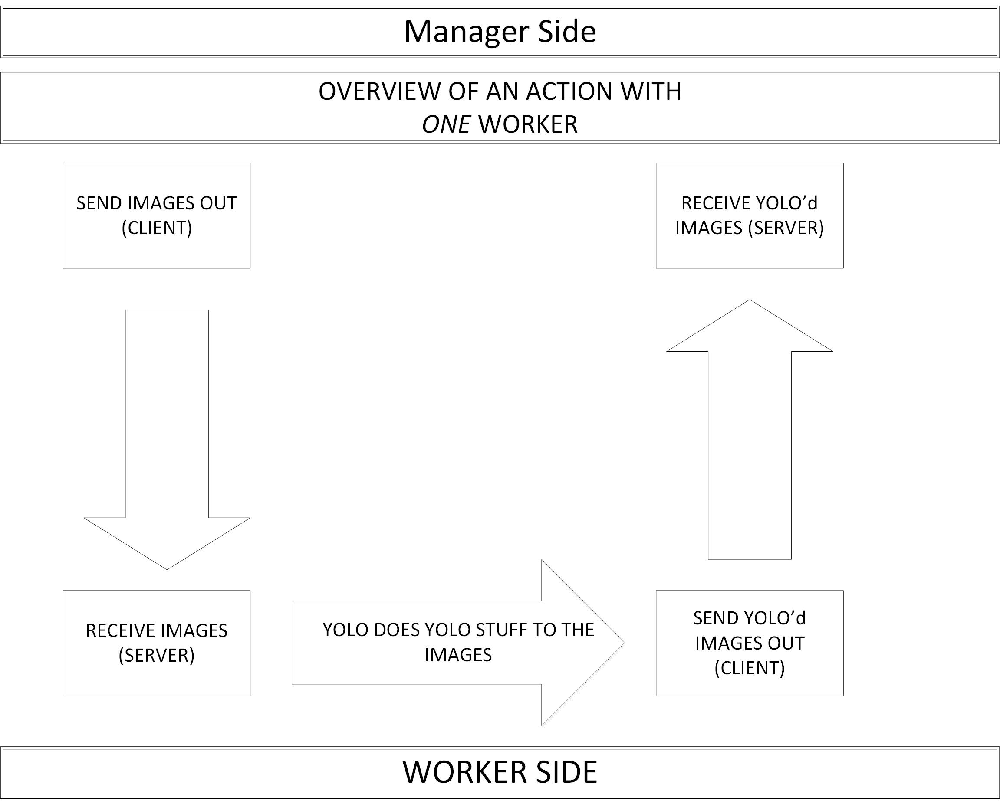

This is a communication unit which establishes a manager (master/controller)
and multiple worker units. We use multi threading to run multiple Servers&Clients
allowing for bi directional flow of information/data.

Compilation for manager:
> g++ -std=c++11 -pthread -I 'path to asio "include" directory' manager.cpp -o man

Compilation for worker:
> g++ -std=c++11 -pthread -I 'path to asio "include" directory' worker.cpp -o work

